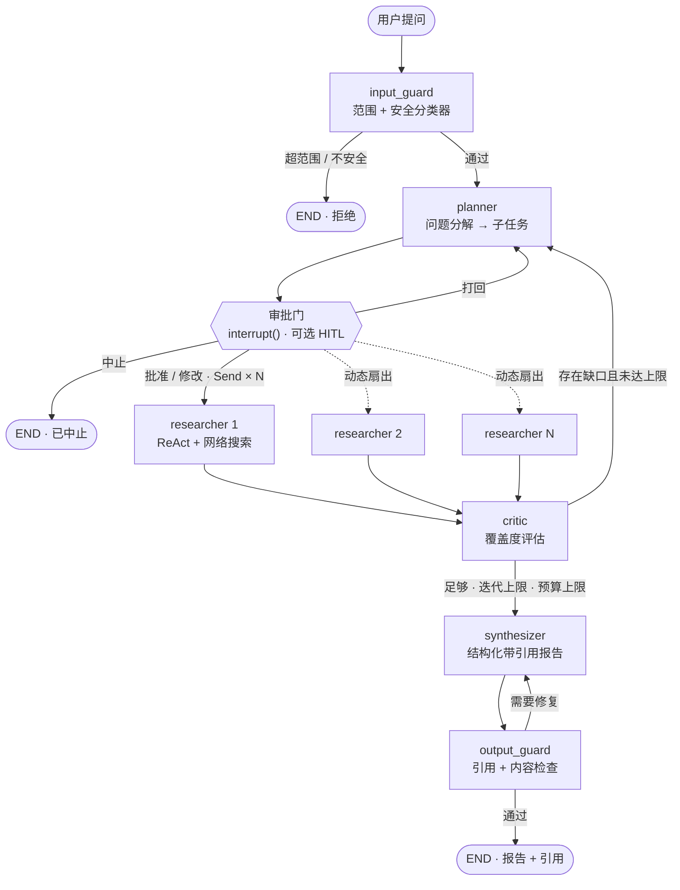
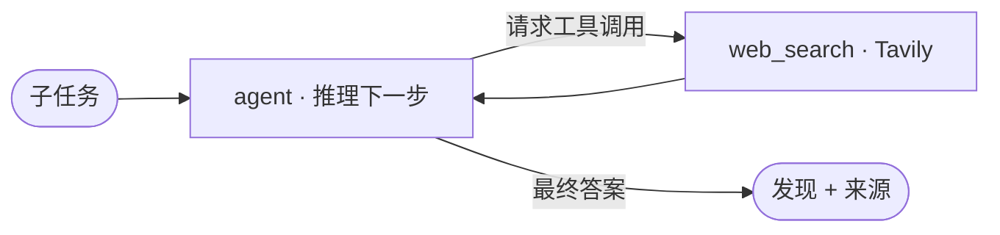
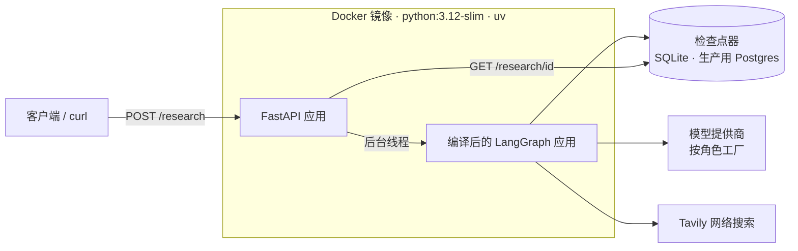

# Deep Research Agent（深度研究智能体）

[](pyproject.toml)
[](https://github.com/langchain-ai/langgraph)
[](https://github.com/northridgedesertcat/deepResearch-agent/actions/workflows/ci.yml)
[](https://github.com/northridgedesertcat/deepResearch-agent/actions/workflows/evals.yml)

一个基于 **LangGraph** 构建的、可持久化的、带引用溯源的**多智能体深度研究系统**，
以一个小巧的 **FastAPI** 服务对外提供能力。

提出一个问题，它会：规划子任务 → 扇出到多个并行的网络研究 worker → 自我评估覆盖度并针对缺口循环补研 →
最终综合出一份**每条结论都能追溯到真实来源**的研究报告——全程由多层输入/输出护栏、硬性调用预算上限、
可选的人工审批门（HITL）保驾护航。

这是一个刻意按"生产形态"打磨的项目：可观测（每次运行生成完整追踪树）、可度量（LLM-as-Judge 评测接入 CI 质量门禁）、
可信赖（护栏 + 退避重试）、可持久化（检查点让运行可恢复、可在人工审批处无限期暂停）。



---

## 目录

- [工作流程](#工作流程)
- [核心能力一览](#核心能力一览)
- [架构](#架构)
- [技术栈](#技术栈)
- [项目结构](#项目结构)
- [关键设计决策](#关键设计决策)
- [快速开始](#快速开始)
- [切换模型：DeepSeek / GLM / Groq / Ollama](#切换模型deepseek--glm--groq--ollama)
- [API 接口](#api-接口)
- [人在回路（HITL）](#人在回路hitl)
- [配置项](#配置项)
- [可观测性](#可观测性)
- [评测与 CI](#评测与-ci)
- [Docker 部署](#docker-部署)
- [测试](#测试)
- [安全须知](#安全须知)
- [致谢与许可](#致谢与许可)

---

## 工作流程

给定一个研究问题，系统运行的是一个**有状态的智能体图**，而不是一条线性的提示链：

1. **输入护栏（input_guard）** —— 一个廉价的分类器在任何开销产生*之前*，拒绝超范围或不安全的查询。
2. **规划器（planner）** —— 用结构化输出把查询分解为 3–5 个聚焦、互不重叠的子任务。
3. **审批门（approval）**（可选）—— 在昂贵的扇出之前暂停，等待人工批准 / 修改 / 打回 / 中止计划。
   默认关闭，智能体默认完全自主。
4. **并行研究员（researcher）** —— 每个子任务一个 **ReAct** 子智能体，各自带网络搜索工具，全部并发运行，
   每个返回发现及其来源。
5. **评审员（critic）** —— 评估聚合发现是否真正覆盖了查询。若存在缺口（且未达上限），带着补充说明回到规划器。
6. **综合器（synthesizer）** —— 产出结构化报告（`summary` + `sections` + `citations`），
   每条论断都锚定在已采集的来源上。
7. **输出护栏（output_guard）** —— 校验引用是否真实、扫描提示词泄漏 / PII；未通过则退回修复，
   超过修复次数则打标记后照常发布。

整个运行**每一步之后都有检查点**，因此可以承受进程崩溃、随时恢复，也能在人工审批处无限期暂停。

---

## 核心能力一览

| 能力 | 所在位置 |
|---|---|
| **智能体编排** —— 并行扇出、有界反思循环 | [graph.py](src/research_agent/graph.py) |
| **多提供商 / 多模型** —— 每个角色一个模型，改环境变量即切换 | [models.py](src/research_agent/models.py)、[config.py](src/research_agent/config.py) |
| **RAG 式溯源与归因** —— 会用工具的研究员 + 带引用的综合 | [nodes/researcher.py](src/research_agent/nodes/researcher.py)、[nodes/synthesizer.py](src/research_agent/nodes/synthesizer.py) |
| **分层护栏与治理** —— 输入范围/安全、输出引用/PII、预算上限、退避重试 | [guardrails.py](src/research_agent/guardrails.py)、[nodes/guardrails.py](src/research_agent/nodes/guardrails.py) |
| **LLMOps：评测 + CI 门禁** —— LLM-as-Judge 指标回归即失败 | [evals/judges.py](evals/judges.py)、[.github/workflows/evals.yml](.github/workflows/evals.yml) |
| **可观测性** —— 每次运行的完整追踪树（LangSmith / OpenTelemetry） | 环境变量驱动（见[可观测性](#可观测性)） |
| **持久化 + 人在回路** —— 检查点、暂停/恢复、审批门 | [persistence.py](src/research_agent/persistence.py)、[nodes/approval.py](src/research_agent/nodes/approval.py) |
| **生产部署** —— FastAPI 先受理后轮询 API、可复现 Docker 镜像 | [api.py](src/research_agent/api.py)、[Dockerfile](Dockerfile) |

---

## 架构

### 智能体图

系统被建模为**状态机**而非流水线。一个单一的类型化状态对象（[`ResearchState`](src/research_agent/state.py)）
在图中流转；每个节点读取它并返回一个部分更新，由 LangGraph 合并回去。这正是线性提示链无法做到的三件事：
**循环**（critic 的反思回路）、**分支**（护栏与审批决策）、**并行**（researcher 扇出）。
文首的流程图就是 [graph.py](src/research_agent/graph.py) 的真实连线。

两个状态设计选择支撑了其余一切：

- **并发写入字段上的 reducer。** `findings` 是 `Annotated[list[Finding], add]`，`llm_calls` 是
  `Annotated[int, add]`。当 N 个 researcher 在同一超级步内写入时，reducer 会**累加**它们的写入，
  而不是让最后一个悄悄覆盖其余的。
- **瞬态路由标记**（`_sufficient`、`_plan_rejected`、`_aborted`）把控制流信号挡在持久化契约之外，
  同时仍能驱动条件边。

### researcher 内部 —— ReAct 子智能体

每个 researcher 节点本身就是一个会**推理并行动**的小型智能体：它判断自己需要什么、调用网络搜索工具、
阅读结果、如此往复，直到能够作答。在节点内部组合出一个智能体循环，正是"复杂流程编排"的实际含义。



该节点（[nodes/researcher.py](src/research_agent/nodes/researcher.py)）使用 LangChain 预置的
`create_agent` 驱动循环，并挂了一个回调**统计智能体内部的模型调用次数**，让预算护栏看到每条分支的
真实成本——即使工具循环调用了未知次数。

### 运行时 / 部署拓扑

编译后的图是*引擎*，FastAPI 层是包在它外面的*车身*。



一次运行包含大量 LLM 调用、耗时数十秒，因此 API 采用**先受理后轮询**（见 [API 接口](#api-接口)）：
`POST` 立即返回 `thread_id`，图在后台线程中运行并持续写检查点。因为结果从**检查点器**读回，
即使服务器重启，`GET` 依然能返回报告——持久化状态本身就是结果存储。

---

## 技术栈

| 层 | 选择 | 理由 |
|---|---|---|
| **编排** | LangGraph | 显式状态机图——干净地获得循环、分支和动态并行的唯一途径。 |
| **LLM 抽象** | LangChain `init_chat_model` | 一次与提供商无关的调用；改个字符串即可换提供商。 |
| **模型** | OpenAI（默认）· 可换 DeepSeek / GLM / Groq / Gemini / Ollama | 按角色选择：高频研究员用便宜模型，规划/综合用更强模型。 |
| **网络搜索** | Tavily（`langchain-tavily`） | 返回干净、可直接喂给 LLM 的文本而非原始 HTML；免费额度慷慨。 |
| **API** | FastAPI + Uvicorn | 异步、自动 OpenAPI 文档、长任务用干净的 `202 + 轮询` 语义。 |
| **持久化** | LangGraph `SqliteSaver`（开发）· `PostgresSaver`（生产） | 持久检查点解锁恢复、崩溃自愈、时间旅行和 HITL。 |
| **校验与配置** | Pydantic + `pydantic-settings` | 类型化状态、结构化 LLM 输出、环境变量驱动的配置 + 代码级默认值。 |
| **评测** | `pytest` + LLM-as-Judge | 无框架、零额外依赖的质量门禁，任何地方都能跑。 |
| **可观测性** | LangSmith / OpenTelemetry | 每次运行的追踪树；按模型规格打标，同一份代码对比不同提供商。 |
| **打包** | `uv` + Docker（`python:3.12-slim`） | 锁文件钉死、可复现、构建快。 |
| **CI** | GitHub Actions | 每个 PR 跑评测门禁，质量回归即失败。 |

---

## 项目结构

```text
deep-research-agent/
├── src/research_agent/
│   ├── config.py          # pydantic-settings：按角色模型 + 护栏/预算/HITL 开关
│   ├── models.py          # 与提供商无关的模型工厂 get_model(role)；invoke_structured 阶梯式重试
│   ├── state.py           # ResearchState（TypedDict）+ Finding；并行安全写入的 reducer
│   ├── graph.py           # build_graph()：节点、边、条件路由 + 交互式 CLI 演示
│   ├── guardrails.py      # 重试策略、LLM 调用计数、引用/内容检查辅助
│   ├── persistence.py     # SqliteSaver 工厂（+ Postgres 生产配方）
│   ├── api.py             # FastAPI 服务：先受理后轮询生命周期、HTTP 上的 HITL
│   ├── research-topic.md  # CLI 演示默认读取的研究问题
│   ├── nodes/
│   │   ├── planner.py      # 查询 → 结构化、互不重叠的子任务
│   │   ├── approval.py     # 人在回路 interrupt() 审批门（approve / edit / reject / abort）
│   │   ├── researcher.py   # ReAct 子智能体（create_agent + web_search）；并行运行
│   │   ├── critic.py       # 覆盖度评估 → 回环或收尾
│   │   ├── synthesizer.py  # 结构化带引用报告（summary + sections + citations）
│   │   └── guardrails.py   # input_guard + output_guard 节点
│   └── tools/
│       └── search.py       # web_search 工具（Tavily）
├── evals/
│   ├── dataset.json        # 研究问题 + 期望要点（中文）
│   └── judges.py           # faithfulness & coverage（LLM 评审）+ citation_accuracy（纯代码）
├── tests/                  # API + 持久化/HITL 测试 —— 无 LLM 调用，CI 安全
├── .github/workflows/
│   ├── ci.yml              # push/PR：ruff + 常规测试（无密钥环境）
│   └── evals.yml           # PR/手动：评测质量门禁
├── Dockerfile              # 基于 uv、锁文件钉死的精简运行时镜像
├── pyproject.toml          # 依赖 + pytest 配置
└── uv.lock                 # 钉死的、可复现的依赖集
```

---

## 关键设计决策

这个项目有意思的地方在于结构背后的推理。以下每个决策都是为了保持系统可扩展、运行便宜、行为可信。

### 1. 与提供商无关的、按角色的模型工厂

每个节点调用 [`get_model("planner")`](src/research_agent/models.py)——从不直接引用提供商类。
一个注册表把逻辑角色映射到从配置读入的 `provider:model` 规格。

- **为什么按角色而不是全局一个模型？** 不同智能体的成本画像不同。researcher 在扇出下调用*很多*次，
  用便宜/快的模型；planner 和 synthesizer 受益于更强的模型。"多模型"是直接的成本杠杆。
- **为什么要有抽象层？** 硬编码的提供商调用是重写之痛的头号来源。这一层意味着 OpenAI →
  DeepSeek/GLM/Groq/Ollama 的切换只是改环境变量，**零代码改动**——还能在同一份代码上横向对比提供商。

### 2. 结构化输出的阶梯式升级重试

OpenAI 兼容提供商（如 DeepSeek）偶尔会用普通文本回答而不是预期的工具调用，LangChain 会把它解析成
`None`——长提示词下更易发生；temperature=0 时每次重试结果完全相同，简单重试没有意义。
[`invoke_structured`](src/research_agent/models.py) 因此实现三级阶梯：

1. 配置的方法 + 配置的 temperature
2. 配置的方法 + temperature 0.7（换一种采样）
3. `json_mode` + temperature 0.7（完全不同的机制）

节点级 `RetryPolicy` 只覆盖网络错误（超时、429 限流），覆盖不了 `None` 结果——这正是阶梯存在的意义。

### 3. 状态优先 + reducer 的设计

状态契约先于节点设计，`findings` 从第一天就带 `add` reducer——当时只有一个 researcher，看似多余。

- **为什么？** 它是并行性的承重墙。没有 reducer，N 个 researcher 在同一超级步写 `findings` 会互相
  静默覆盖、丢数据。提前声明意味着扇出"开箱即用"，无需改状态——为尚不存在的东西做设计的教科书案例。

### 4. 用 `Send` 做动态扇出

planner 在*运行时*决定生成多少个 researcher；图按子任务逐个发出 [`Send`](src/research_agent/graph.py)，
每个携带自己的状态切片。扇入是隐式的——所有 worker 结束后 critic 自然运行。

- **为什么动态而不是固定边数？** 合理的研究员数量取决于问题本身。这是区分"我串了几条提示"和
  "我建了一个智能体系统"的分水岭。

### 5. 有界的反思循环

critic 可以把图送回 planner 补缺口——一个**循环**。每个循环同时受迭代计数和硬性 LLM 调用预算约束；
任一上限触顶，或 critic 判定"足够"，都会落到 synthesizer，保证报告总能交付。

- **为什么上限放在配置而不是代码里？** `max_research_iterations` 和 `max_llm_calls_per_run` 是
  防失控成本的操作护栏。放在 [config.py](src/research_agent/config.py) 里，按环境调参无需改逻辑。

### 6. 经结构化输出实现可追溯的引用

发现（finding）全程携带 `source_url`，synthesizer 产出**结构化输出**
（`summary` / `sections` / `citations`），使每份报告可溯源、可归因。

- **为什么？** 归因既是质量特性，也是治理/可解释性要求。无法追溯到来源的研究报告毫无价值——
  而这恰恰是评测体系随后*度量*的东西。

### 7. 分层护栏 + 抗限流重试

护栏在三个点包住图（实现见 [guardrails.py](src/research_agent/guardrails.py) 与
[nodes/guardrails.py](src/research_agent/nodes/guardrails.py)）：

- **输入** —— 范围/安全分类器在任何花费之前拒绝坏请求。分类器的领域描述可通过
  `GUARDRAIL_DOMAIN` 调整，无需改代码。
- **输出** —— *硬性*引用门（被引 URL 必须出现在已采集发现中）+ 提示词泄漏/PII 内容扫描；
  未通过触发有界修复循环，超限则打标记发布。
- **运营** —— 上文预算上限，加上每个 LLM 节点的 `RetryPolicy`，对 `429` / `5xx` / 超时做指数退避
  （1s → 2s → 4s → 8s）。扇出会并发发起大量调用，免费额度限流是真实的工程问题，重试策略就是让
  免费 key 活下来的手段。

### 8. 持久化 + 人在回路

LangGraph **检查点器**在每个超级步之后持久化状态，以 `thread_id` 为键。这一个组件同时解锁了
暂停/恢复、崩溃自愈、时间旅行调试和 HITL。审批门（[nodes/approval.py](src/research_agent/nodes/approval.py)）
正卡在昂贵的扇出之前——人工签收的最佳位置。

- **为什么默认 SQLite、生产换 Postgres？** SQLite 是零配置的本地文件，开发和单进程服务够用；
  多 worker 部署换成 `PostgresSaver`——**只换 saver，图代码一行不动**。生产配方在
  [persistence.py](src/research_agent/persistence.py)。
- **为什么默认关闭？** 评测、CI 和 API 默认路径绝不能阻塞在人工上。HITL 通过 `HITL_APPROVAL_ENABLED`
  按次开启。
- **注意**：HITL 只有在存在检查点器时才会真正暂停——`interrupt()` 需要持久化状态才能恢复。

### 9. 先受理后轮询的 API

`POST /research` 在后台线程运行图，立即返回 **HTTP 202** 和一个 `thread_id`；
客户端轮询 `GET /research/{thread_id}`。

- **为什么不用一个阻塞请求？** 让 HTTP 连接挂起几十秒很脆弱——代理和负载均衡器会超时。
  立即返回、从检查点器读回结果，既健壮又重启安全。一个小型线程安全注册表跟踪活动状态；
  对不在内存里的运行（如重启后），状态从持久化检查点推断。

### 10. 质量是被度量、被 CI 门禁的属性

一个小型 `pytest` 评测体系（[evals/judges.py](evals/judges.py)，由
[tests/test_evals.py](tests/test_evals.py) 驱动）让智能体跑完评测数据集，用 **LLM-as-Judge**
（faithfulness、coverage）加一个**确定性**引用检查（不花 judge 的钱）给每次输出打分。
GitHub Actions 在每个 PR 上运行它，平均分低于 config 阈值即**构建失败**。

- **为什么？** 对自由文本的智能体输出，"正确"是模糊的——你需要评审器、数据集和回归门禁。
  这是让评审者信任这个仓库的关键工件：它把智能体质量当作可度量的属性，而不是一种感觉。

---

## 快速开始

> 项目使用 [`uv`](https://docs.astral.sh/uv/)（Astral 出品）——一个替代 `venv` + `pip` 的快速工具。
> 用独立安装脚本安装后重开终端：
>
> ```powershell
> # Windows (PowerShell)
> powershell -ExecutionPolicy ByPass -c "irm https://astral.sh/uv/install.ps1 | iex"
> ```
> ```bash
> # macOS / Linux
> curl -LsSf https://astral.sh/uv/install.sh | sh
> ```

需要两把钥匙：一个 LLM 提供商 key 和一个 Tavily 搜索 key。在项目根目录创建 `.env`
（所有可选项见 [`.env.example`](.env.example)）：

```dotenv
OPENAI_API_KEY=sk-...
TAVILY_API_KEY=tvly-...
```

然后启动 API 服务——`uv` 会读锁文件、建环境、跑命令，一步到位：

```bash
uv run uvicorn research_agent.api:api --reload
```

服务起在 <http://127.0.0.1:8000>，交互式 API 文档在 <http://127.0.0.1:8000/docs>。

想看着智能体端到端地思考（并打开人工审批门）？运行内置 CLI 演示：

```bash
uv run python -m research_agent.graph                      # 使用 src/research-topic.md 中的问题
uv run python -m research_agent.graph "你的研究问题"         # 或直接在命令行给出
```

> **注意**：检查点数据库路径（`checkpoints.db`）按当前工作目录解析，
> 请务必从项目根目录运行。

---

## 切换模型：DeepSeek / GLM / Groq / Ollama

每个角色一个模型规格，格式为 `provider:model`，通过环境变量切换：

```dotenv
MODEL_PLANNER=openai:gpt-4o
MODEL_RESEARCHER=openai:gpt-4o-mini
MODEL_SYNTHESIZER=openai:gpt-4o
MODEL_CRITIC=openai:gpt-4o-mini
MODEL_JUDGE=openai:gpt-4o-mini
```

**DeepSeek**（OpenAI 兼容接口）——必须把结构化输出方式切到 `function_calling`，
因为 DeepSeek 不支持 OpenAI 原生 `json_schema`（会返回 400）：

```dotenv
OPENAI_BASE_URL=https://api.deepseek.com
MODEL_RESEARCHER=openai:deepseek-chat
STRUCTURED_OUTPUT_METHOD=function_calling
```

**智谱 GLM**（OpenAI 兼容接口）——function calling 结构化输出稳定性好：

```dotenv
OPENAI_BASE_URL=https://open.bigmodel.cn/api/paas/v4/
MODEL_RESEARCHER=openai:glm-4.6        # 或 openai:glm-4.5-air
STRUCTURED_OUTPUT_METHOD=function_calling
```

**其他提供商** —— 换免费提供商跑高频研究员只是一行改动，例如
`MODEL_RESEARCHER=groq:llama-3.3-70b-versatile`（配 `GROQ_API_KEY`），
或 `MODEL_RESEARCHER=ollama:llama3.1` 用本地零成本模型。

---

## API 接口

一次研究运行耗时较长，因此 API 是**先受理后轮询**：立即拿到 `thread_id`，结果就绪后再取。

| 方法与路径 | 用途 |
|---|---|
| `GET /health` | 存活探针 → `{"status":"ok"}` |
| `POST /research` | 启动一次运行。请求体 `{"query": "..."}` → `202` `{"thread_id","status":"running"}` |
| `GET /research/{thread_id}` | 轮询状态；`status="completed"` 时附带报告 |
| `POST /research/{thread_id}/resume` | 恢复暂停在人工审批门的运行 |

### 示例

```bash
# 1. 启动一次运行 —— 立即返回 thread_id
curl -s -X POST http://127.0.0.1:8000/research \
  -H 'Content-Type: application/json' \
  -d '{"query": "RAG 与微调各自的权衡是什么？"}'
# {"thread_id":"a1b2c3...","status":"running"}

# 2. 轮询直到 status == "completed"
curl -s http://127.0.0.1:8000/research/a1b2c3...
```

完成后的响应：

```json
{
  "thread_id": "a1b2c3...",
  "status": "completed",
  "report": {
    "summary": "...",
    "sections": ["..."],
    "citations": ["https://..."]
  },
  "guardrail_flags": [],
  "llm_calls": 7,
  "error": null
}
```

`status` 取值：`running`、`completed`、`error`（运行抛异常——见 `error`）、
`interrupted`（暂停在人工审批门，或从上一个进程恢复后无活动跟踪）。
由于每次运行都有检查点，即使服务器重启，`GET` 也能返回报告。

---

## 人在回路（HITL）

默认智能体完全自主、从不停顿。设置 `HITL_APPROVAL_ENABLED=true` 后，规划器之后、昂贵扇出之前
会插入一个审批门。运行随即暂停为 `status: "interrupted"`，并携带 `interrupt` 载荷描述拟定计划：

```jsonc
{ "status": "interrupted",
  "interrupt": { "type": "plan_approval", "query": "...",
                 "proposed_subtasks": ["...", "..."], "message": "审核计划……用 resume 恢复" } }
```

带着人工裁决恢复运行：

```bash
# 原样批准计划
curl -s -X POST http://127.0.0.1:8000/research/<thread_id>/resume \
  -H 'Content-Type: application/json' -d '{"action": "approve"}'

# 或者：修改子任务 / 打回（重新规划）/ 中止
#   {"action": "edit",   "subtasks": ["...", "..."]}
#   {"action": "reject", "feedback": "太宽泛了"}      # 重新规划并再次暂停
#   {"action": "abort",  "reason": "不值得研究"}       # 干净地结束运行
```

`reject` 会重新规划并*再次*暂停，所以两次 resume 之间请轮询 `GET`。对不在等待输入的运行调用
resume 会得到 `409`。由于暂停本身就是一个持久化检查点，你甚至可以恢复一个在早前进程里暂停的运行。

---

## 配置项

一切都由环境变量驱动，[config.py](src/research_agent/config.py) 里有合理的代码级默认值。
最常用的开关：

| 变量 | 默认值 | 用途 |
|---|---|---|
| `OPENAI_API_KEY` | — | **必需。** LLM 提供商 key。 |
| `TAVILY_API_KEY` | — | 真实网络搜索**必需**。 |
| `MODEL_PLANNER` | `openai:gpt-4o` | 规划器模型。 |
| `MODEL_RESEARCHER` | `openai:gpt-4o-mini` | 研究员模型（高频 → 用便宜的）。 |
| `MODEL_SYNTHESIZER` | `openai:gpt-4o` | 综合器模型。 |
| `MODEL_CRITIC` | `openai:gpt-4o-mini` | 评审员模型。 |
| `MODEL_JUDGE` | `openai:gpt-4o-mini` | 评测 judge 模型。 |
| `STRUCTURED_OUTPUT_METHOD` | `json_schema` | 结构化输出方式：`json_schema` / `function_calling` / `json_mode`。 |
| `MAX_RESEARCH_ITERATIONS` | `2` | 反思循环上限。 |
| `MAX_LLM_CALLS_PER_RUN` | `22` | 每次查询的硬性调用预算。 |
| `GUARDRAIL_INPUT_ENABLED` | `true` | 输入端范围/安全分类器。 |
| `GUARDRAIL_OUTPUT_ENABLED` | `true` | 输出端引用 + 内容门。 |
| `GUARDRAIL_DOMAIN` | （见 config） | 输入分类器的领域描述，注入提示词。 |
| `MIN_CITATION_COVERAGE` | `0.8` | 被引 URL 中必须真实存在的最低比例。 |
| `MAX_OUTPUT_REPAIRS` | `1` | 打标记发布前的修复尝试次数。 |
| `RETRY_MAX_ATTEMPTS` | `4` | 对 `429` / `5xx` / 超时的退避重试次数。 |
| `HITL_APPROVAL_ENABLED` | `false` | 规划器之后的人工审批门。 |
| `CHECKPOINT_DB_PATH` | `checkpoints.db` | SQLite 检查点文件。 |
| `EVAL_MIN_FAITHFULNESS` | `0.7` | CI 评测门禁：忠实度阈值。 |
| `EVAL_MIN_CITATION_ACCURACY` | `0.8` | CI 评测门禁：引用准确率阈值。 |
| `EVAL_MIN_COVERAGE` | `0.5` | CI 评测门禁：覆盖度阈值。 |
| `VERBOSE` | `true` | 各节点把进度（带时间戳）打印到 stderr。 |
| `LANGSMITH_TRACING` | *(未设置)* | 设为 `true` 开启 LangSmith 追踪。 |

---

## 可观测性

追踪是**环境变量驱动**的——零代码改动。把标准 LangSmith 变量指向你的项目，
每次图运行都会呈现为一棵可导航的树：LLM 调用、工具调用、延迟、每个节点的 token/成本：

```dotenv
LANGSMITH_TRACING=true
LANGSMITH_API_KEY=ls-...
LANGSMITH_PROJECT=deep-research-agent
```

每次运行都按各角色使用的模型规格打标，可以在追踪界面里用*同一份代码*直接对比提供商
（`openai:...` vs `glm:...`）。图还会发出 OpenTelemetry 兼容的 span，
想保持厂商中立的话可以接入任意 OTel 后端（Tempo、Jaeger 等）。

---

## 评测与 CI

质量是**被度量、被门禁**的属性。评测体系（[evals/judges.py](evals/judges.py)，由
[tests/test_evals.py](tests/test_evals.py) 驱动）让智能体跑完
[evals/dataset.json](evals/dataset.json)，按三个指标打分：

- **Faithfulness（忠实度）**（LLM-as-Judge）—— 报告的论断是否被已采集发现支持，还是凭空捏造？
- **Coverage（覆盖度）**（LLM-as-Judge）—— 报告是否覆盖了查询的各个要点？
- **Citation accuracy（引用准确率）**（纯代码，免费）—— 被引 URL 是否真的出现在已采集发现中？

前两项通过 `invoke_structured` 阶梯式重试拿到评审结果；第三项是纯集合运算，零成本。

CI 配了两条流水线：

- **ci.yml**：push / PR 到 `main` / `develop` 时运行 `ruff` + 常规测试
  （`pytest -m "not eval"`，无密钥环境即可）。
- **evals.yml**：PR 到 `main` / `develop` 或手动触发时运行评测门禁，平均分低于
  [config.py](src/research_agent/config.py) 阈值即**构建失败**。CI 用 `EVAL_MAX_CASES=3`
  限制数据集规模以控制成本；需在仓库 Secrets 中配置 `OPENAI_API_KEY` 与 `TAVILY_API_KEY`。

本地运行：

```bash
uv run pytest -m "not eval"    # 快速套件：无 LLM 调用、无密钥要求
uv run pytest -m eval -s       # 完整评测：慢，消耗 LLM 调用
```

PowerShell 下限制用例数量：`$env:EVAL_MAX_CASES="3"; uv run pytest -m eval -s`；
cmd 下：先 `set EVAL_MAX_CASES=3` 再运行。

---

## Docker 部署

[Dockerfile](Dockerfile) 采用 `uv` 工作流：从官方镜像复制 `uv` 二进制，基于提交的 `uv.lock`
安装依赖，保证构建**可复现**。`--frozen` 在锁文件过期时报错；`--no-dev` 跳过仅测试用的依赖；
[.dockerignore](.dockerignore) 保持构建上下文精简，并把机密（`.env`）与本地状态（`*.db`）
**挡在镜像之外**。

```bash
docker build -t deep-research-agent .
docker run --rm -p 8000:8000 \
  -e OPENAI_API_KEY=sk-... \
  -e TAVILY_API_KEY=tvly-... \
  deep-research-agent
```

API 随即起在 <http://localhost:8000>。密钥通过环境变量传入，**绝不烘焙进镜像**——
换提供商只是改环境变量，无需重新构建。任何有免费 Docker 档位的平台
（Render、Fly.io、Hugging Face Spaces 等）都能托管。

---

## 测试

```bash
# 快速套件 —— 无 LLM 调用、无需 API key、不碰真实数据库。CI 跑的就是它。
uv run pytest -m "not eval"

# 完整质量评测 —— 慢，消耗 LLM 调用（见"评测与 CI"）。
uv run pytest -m eval
```

快速套件覆盖 API 生命周期（`202` → 轮询 → 报告，错误/`404` 路径，HITL 暂停/恢复）和持久化
（用全新数据库连接恢复一个暂停的运行），全部使用**桩节点**，因此任何没有凭证的环境都能跑。
测试均为桩图，不发起任何 LLM 调用与网络请求。

---

## 安全须知

**HTTP API 刻意不做认证** —— 它面向本地或私有网络中的演示与开发，*不*适合直接暴露在公网。
应用内刻意没有内置认证、CORS 策略或限流；若要部署到可达的网络位置，请在其前面架设你自己的
网关 / 反向代理来做认证、CORS、TLS 和限流。智能体每次运行会扇出大量 LLM 调用，一个挂着真实
提供商密钥的开放端点是直接的的成本与滥用入口——虽然存在单次运行的硬性调用上限
（`MAX_LLM_CALLS_PER_RUN`）和请求体大小上限，但那些只是兜底，不是网络层控制。

机密只通过环境变量 / 本地 `.env`（已被 git 忽略，也被挡在 Docker 镜像外）提供，绝不提交。

---

## 致谢与许可

本项目衍生自一个 MIT 许可的开源模板（© Lucas Battistella），并在此基础上深度定制：
中文评测数据集、DeepSeek / GLM 支持、结构化输出阶梯式重试等。
